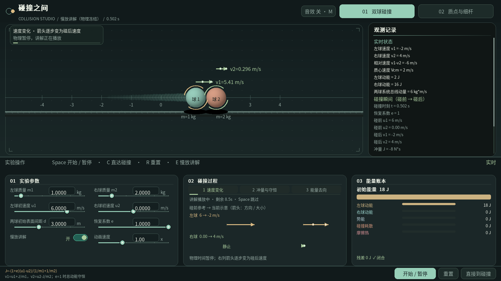
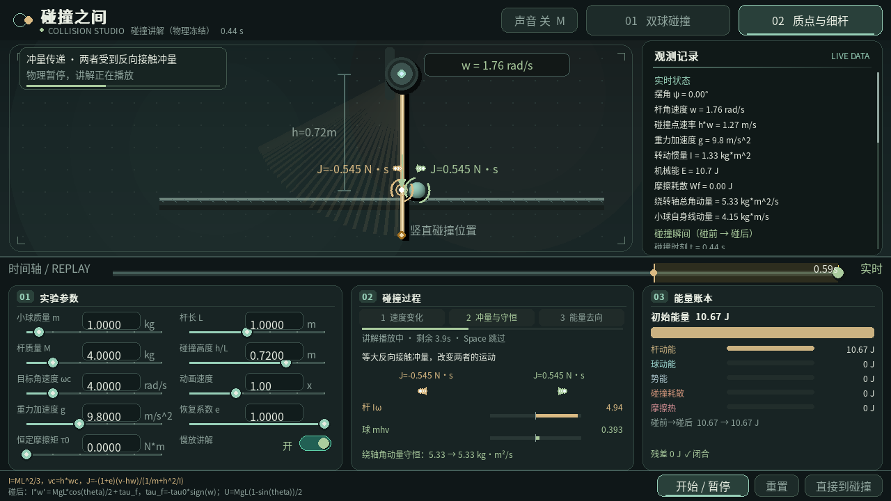
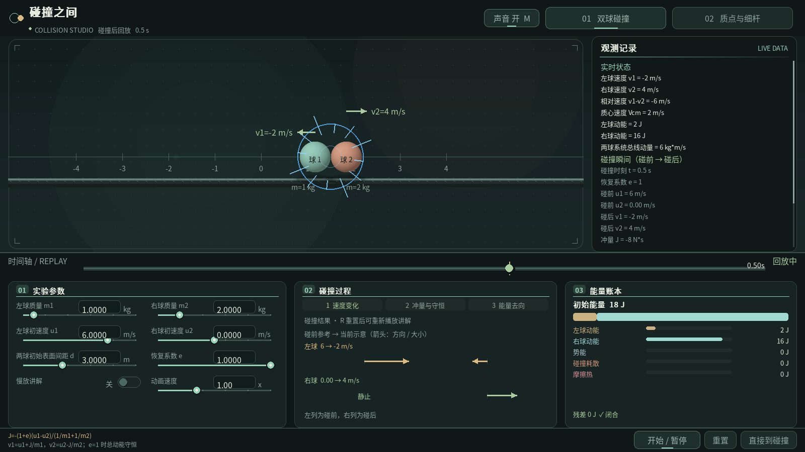
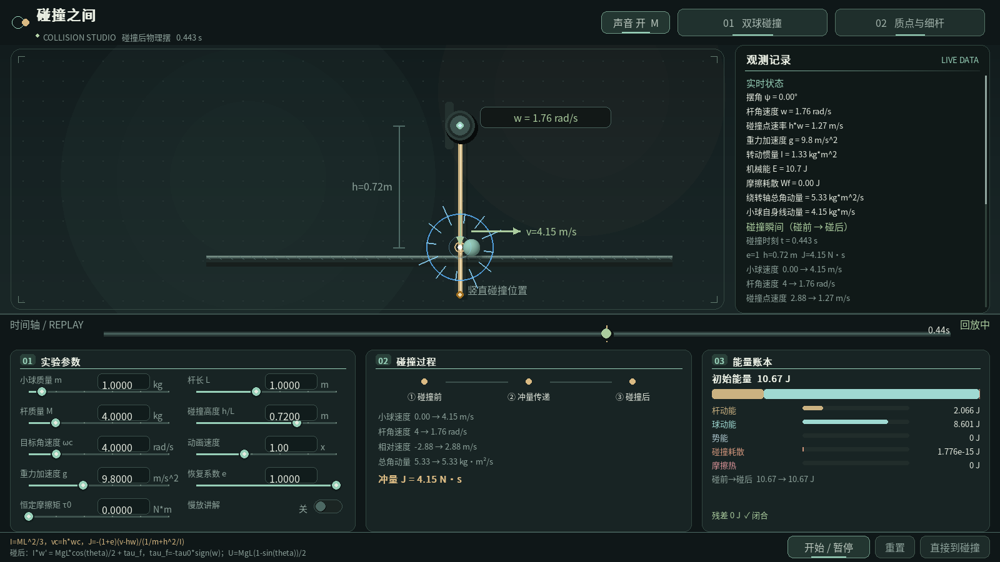

# 碰撞之间 · Collision Studio

基于 Python 和 pygame 的物理竞赛教学仿真程序，包含：

- 双球一维碰撞（可调恢复系数）
- 重力场中质点与定轴细杆碰撞，并按目标碰撞角速度反算初始摆角/初始角速度

## 美术重构

以安静的桌面实验室为主题：墨绿灰底色、薄荷绿与陶土色球体、暖金色细杆。
背景使用稀疏点阵和缓慢漂浮的微粒，球体采用缓存的柔和光照材质；碰撞改为少量
光点和细涟漪，减少杆轨迹的透明度，保留速度、冲量与能量流的教学标记。
球体和细杆采用真正的半透明柔边投影；按钮、标签、开关和工作区标题加入短促缓动，
状态点使用低幅度呼吸动画，动效不会改变物理时间或 Replay 结果。

布局按“实验参数 → 碰撞过程 → 能量账本”从左至右排列，顶部统一品牌与模型
选择，右侧观测记录有可见滚动条。双球与细杆模型都提供完整 Replay 时间轴，
可拖动查看碰撞前后状态并逐帧播放。

音效默认开启，点击顶栏“声音”或按 `M` 开关。碰撞音为程序合成的短促柔和敲击，
无需下载音频素材；没有音频设备时自动显示“音效不可用”，仍可正常仿真。




连续动画演示：[preview.mp4](docs/preview.mp4)（无声录屏）。

## 运行

```bash
python -m pip install -r requirements.txt
python main.py
```

依赖为 `pygame-ce>=2.5.8`（pygame 社区分支，不是原版 `pygame` 包），
`requirements.txt` 会自动安装正确的版本。

## 目录结构

- `config.py`：窗口、布局和颜色配置
- `utils.py`：通用工具函数
- `core/`：pygame 显示资源和字体
- `render/`：通用绘图原语和 `render/energy/` 能量账本绘制包
- `ui/`：滑块、按钮、输入框
- `effects/`：粒子和冲击波效果
- `models/`：模型基类及两个碰撞模型
- `replay/`：固定采样的只读 Replay 帧和时间轴
- `tests/`：单元测试和回归测试（`python -m unittest discover tests`）
- `main.py`：应用程序入口和事件循环

## Replay 回放

两个模型都会在运行时保存固定采样的只读展示帧。碰撞是时间轴上的瞬时事件：
`collision_before` 与 `collision_after` 共用物理碰撞时刻 `t_c`，拖到黄色刻度
可查看碰后状态，逐帧向左则可查看碰前状态。事件后的蓝色冲击环会短暂衰减，
但球和杆继续按真实时间运动，时间轴不会出现慢动作色带或额外长度。

双球帧保存两球位置、速度、动能和线动量；细杆帧保存杆/球动能、势能、碰撞
耗散、摩擦热、角动量和账本残差。回放不会修改实时物理状态，也不依赖随机
粒子或实时时钟。




- 点击或拖拽底部时间轴：seek 到任意时刻
- `1` / `2`：切换"双球一维碰撞" / "质点—定轴细杆碰撞"模型
- `Space`：开始/暂停回放（或实时仿真）
- `←` / `→`：按采样间隔逐帧查看
- `P`：退出回放并回到最新实时帧
- `C`：推进到碰撞（双球解析推进，细杆使用真实物理子步并限制 120 s）；`R`：重置并清空当前 Replay
- `E`：开启/关闭慢放讲解（两个模型均支持；也可使用参数面板中的“慢放讲解”开关）
- `Esc`：退出程序

默认窗口为 `1600×900`，可自由缩放，最小支持 `1280×720`。界面同时保留
碰撞重演、参数设置和能量账本三个面板；窗口变化时会重新排版，不会重置参数、
实时状态或 Replay。右侧信息面板可滚动查看实时量以及最近一次碰撞的碰前/碰后
速度、角速度、冲量、角动量和能量误差。

能量账本分别显示杆/左球动能、球/右球动能、势能、碰撞耗散、摩擦热和数值
残差；碰撞过程面板以“速度变化—冲量与守恒—能量去向”三个阶段呈现。

## 碰撞慢放讲解（两个模型）

双球模型默认关闭讲解；开启后，碰撞会冻结物理时间 9 秒，依次显示速度变化、
冲量与动量守恒、能量去向。Space 跳过本次讲解，E 关闭时立即继续运动。
速度面板左列保留碰前参考，右列箭头连续变为碰后速度；数值行固定标注
碰前→碰后的端点。箭头表示方向和大小，不表示位置轨迹。
只有等质量且完全弹性时才是“速度交换”；一般情形称为“速度变化”。
细杆绘图中，小球中心相对碰撞位移坐标偏移一个球半径加半个杆宽，
使竖直杆的可见边缘与球面相切；理想质点—细杆模型的冲量公式保持不变。

质点—细杆模型也默认关闭慢放讲解；开启后，碰撞瞬间程序会生成碰撞快照并冻结碰后
运动状态，进入 `impact_explain` 讲解阶段，逐步展示冲量传递、角动量分配
和能量闭合过程。两个模型的镜头都会缓慢拉近、停留再拉回，最多放大至 1.24 倍；
取景范围根据窗口尺寸自动限制，保留转轴、杆尖和小球。讲解播放完毕后自动提交碰撞结果，
继续实时仿真。讲解期间按 `Space`（开始/暂停）或 `C`（直接到碰撞）可以
立即跳过讲解并提交冻结的碰后状态；按 `E` 或使用参数面板中的“慢放讲解”
开关可彻底开启/关闭该功能，关闭后碰撞瞬间直接提交结果，不再冻结画面。

每个阶段都包含动态提示：速度箭头逐步改变长度与方向；冲量箭头带方向流光，
动量分量条逐步分配；能量条与能量账本同步变化，场景中的光点展示能量流向。
完全弹性碰撞的能量阶段也持续显示运动光点和聚焦弧线，不会因耗散为零而静止。
进度条与剩余秒数明确表示讲解在播放。这些动画只使用展示时间，物理时间、
碰撞快照和 Replay 记录不随讲解时长改变。

开发时可用 `python tests/render_review.py /输出目录` 检查静态布局，
或用 `python tests/render_motion.py /输出文件.mp4` 录制两模型的连续演示（需 ffmpeg）。

## 质点—细杆模型约定

第二个模型中，小球静止在杆的碰撞高度，输入的目标角速度 `ωc` 是碰撞
瞬间细杆的角速度，碰撞点线速度为 `vc = h·ωc`；它不是小球入射速度，
也不是杆尖端速度。碰撞前细杆在重力
场中从初始位置摆到竖直向下位置，程序使用

```text
I = M L^2 / 3                 vc = h * wc
1/2 I wc^2 = 1/2 I w0^2 + MgL/2 * (1 - sin(theta0))
```

自动反解初始状态。可由重力从静止释放达到的目标角速度对应 `0°--90°`
的初始摆角（角度从竖直向下方向量起）；若目标角速度超过该范围，则固定从
`90°` 出发并补充初始角速度。将 `g` 设为 `0` 时，模型自动使用纯初始角
速度分支。碰撞瞬间采用冲量模型，恢复系数 `e` 可调（`e=1` 为完全弹性
碰撞），满足

```text
v' - h*w' = -e * (v - h*w)
```

并验证绕转轴的角动量守恒；碰后细杆继续在重力场中按物理摆运动，小球按
碰撞后的速度做水平运动。这里的守恒量是

```text
L轴 = Iω + m h v
```

而不是球—杆整体线动量：定轴反力可以提供线动量冲量。界面中的“转轴外冲量”
是线动量诊断量；双球模型则继续显示“两球系统总线动量”。`e<1` 造成的
瞬时机械能差额记为“碰撞能量耗散”，碰撞和恒定转轴摩擦热分别进入能量账本，
只有剩余的数值闭合差显示为“账本残差”。
# 四主题切换版

窗口顶部可直接切换「绿色」「蓝色」「黑色」「白色」。
四种主题共用当前版本的功能与布局。
主题切换即时生效，不重置实验参数或仿真时间。默认使用黑色。
安装依赖：`python -m pip install -r requirements.txt`，启动：`python main.py`。
